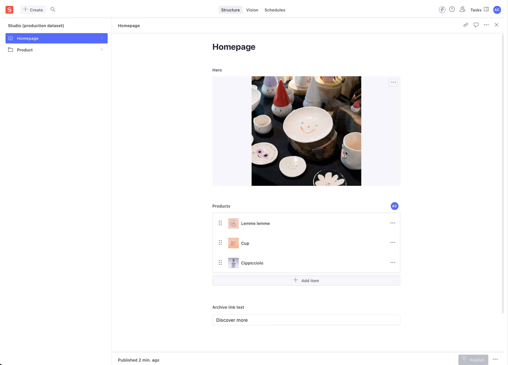
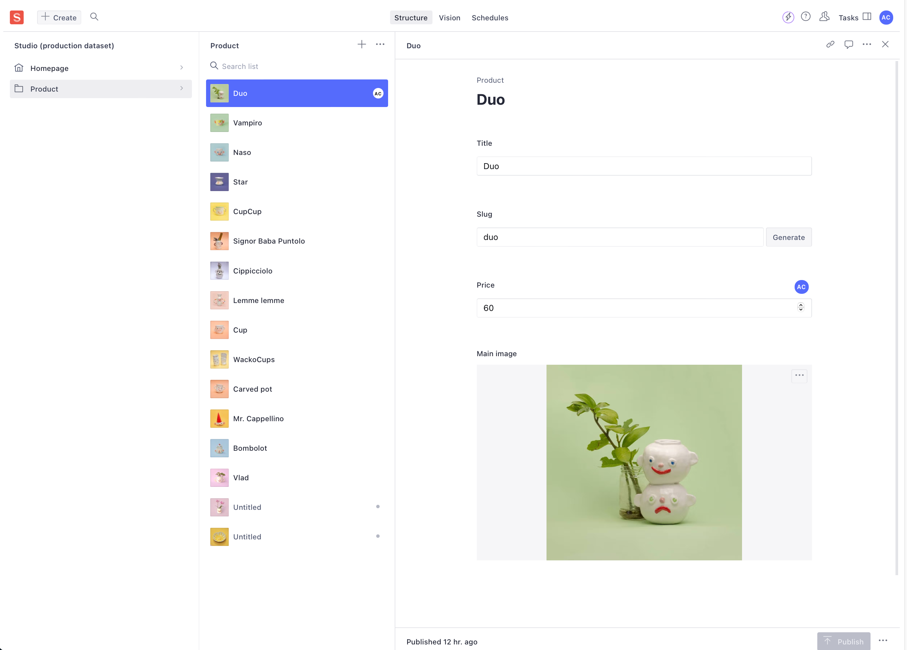

## Website
## [https://pottery-one.vercel.app](https://pottery-one.vercel.app)

## About

Pottery is a website for showcasing pottery products. Built with Next.js and Sanity, it features a customizable homepage, dynamic product pages, and a fully integrated Sanity Studio for content management. It also includes smooth page transition animations for an enhanced browsing experience.

## Sanity Studio

### Homepage


### Product page



#### To run locally:

Create `.env` file (see `.env.example`), then run:

```bash
npm install
npm run dev
```

Open [http://localhost:3000](http://localhost:3000) with your browser to see the result.

Studio is mounted on [http://localhost:3000/studio](http://localhost:3000/studio) route.
